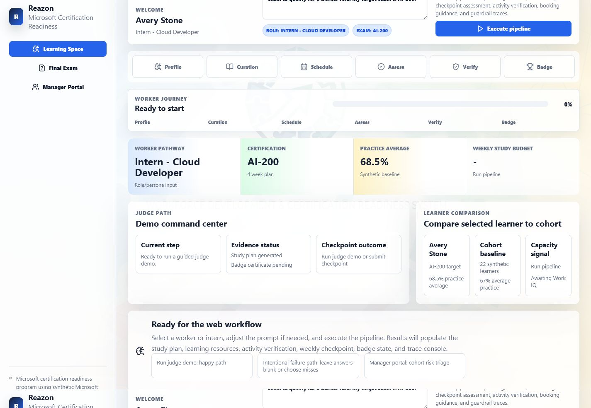
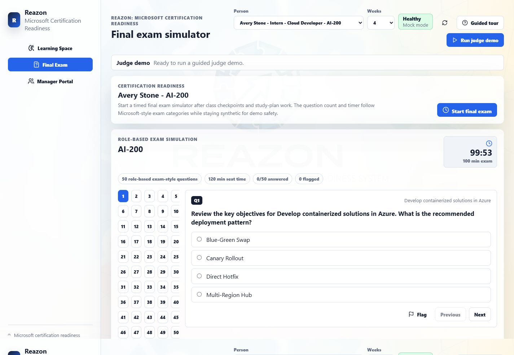
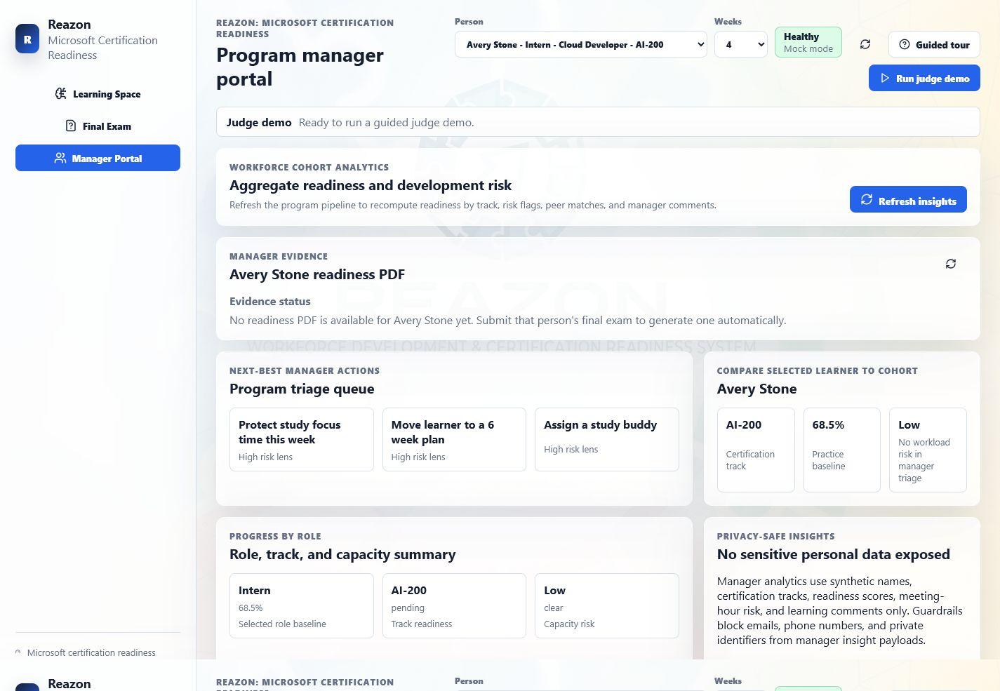
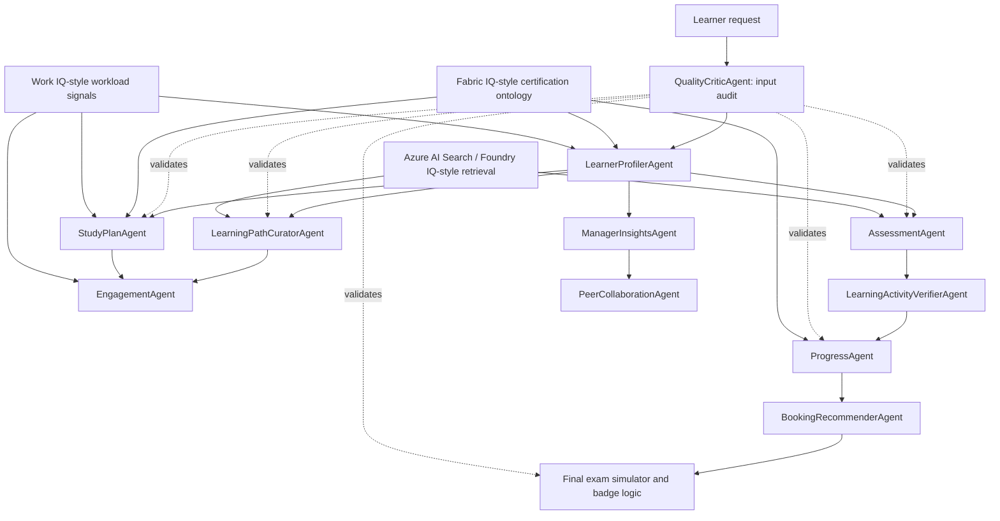

# Reazon AI: Microsoft Workforce Certification Platform

An 11-agent reasoning platform that helps organizations develop interns and junior workers through Microsoft certification readiness by planning study paths, scheduling learning, testing readiness, verifying progress, and surfacing manager insights with synthetic workforce data and grounded Azure retrieval.

[](.)
[](.)
[](.)
[](.)
[](.)

## At A Glance

| Question | Answer |
|---|---|
| What it is | A multi-agent workforce learning and certification readiness platform |
| Who it helps | Startup teams, interns, junior workers, team leads, and program managers |
| Why reasoning matters | Readiness depends on role, exam domain weights, study evidence, workload, assessments, and manager risk signals |
| Microsoft IQ usage | Synthetic certification guides are retrieved through Azure AI Search as a Foundry IQ-style grounded knowledge layer |
| Data policy | Synthetic learner, work, LMS, and certification data only |
| Main surfaces | React web app, FastAPI backend, Streamlit app, PDF reports |
| Youtube Video Link | https://youtu.be/u4lk25aZIjM |
|Webapp link | https://reazon.up.railway.app/ |

## The Problem

Organizations want interns and junior workers to grow into productive cloud, AI, data, security, and business application roles, but certification programs are difficult to manage at team scale.

Managers often rely on spreadsheets, manual reminders, generic learning links, and self-reported progress. That makes it hard to answer practical questions:

- Which Microsoft certification should each worker pursue?
- What should they study this week?
- Does their calendar leave enough focus time to complete the plan?
- Are checkpoint scores grounded in approved study material?
- Who is ready to book an exam, who needs remediation, and who is at risk?

Reazon AI was built for that gap.

## The Solution

Reazon AI coordinates 11 specialized agents to turn a worker role and certification goal into an evidence-backed readiness workflow.

The system profiles the learner, retrieves cited certification knowledge, maps exam domains to study resources, creates a workload-aware schedule, generates grounded practice tests, verifies learning activity, scores readiness, recommends a booking decision, unlocks synthetic badges, and gives managers aggregate team visibility.

The demo uses synthetic data for safety, but the retrieval layer can run against a real Azure AI Search index named `reazon-cert-guides`, giving the agents cited knowledge before they generate plans, tests, and recommendations.

## Screenshots

| Learner workspace | Final exam simulator | Manager portal |
|---|---|---|
|  |  |  |

## What It Does

```text
Worker role + target exam
    -> learner profile
    -> cited certification knowledge retrieval
    -> domain-specific learning path
    -> workload-aware weekly study schedule
    -> grounded checkpoint questions
    -> learning activity verification
    -> readiness score
    -> GO / CONDITIONAL GO / NOT YET
    -> final exam simulator
    -> synthetic badge and manager dashboard
```

Core capabilities:

- Profiles interns and workers from role, experience, and certification goals.
- Supports Microsoft certification tracks across Azure, AI, Fabric, data, security, Microsoft 365, Dynamics, Power Platform, DevOps, and architecture.
- Retrieves cited certification guide content from Azure AI Search when configured.
- Falls back to local synthetic markdown guides for reliable demos.
- Builds week-by-week study plans using workload-aware Largest Remainder allocation.
- Generates cited checkpoint questions and timed final exam simulations.
- Verifies synthetic learning activity from Microsoft Learn/LMS/Teams-style evidence.
- Calculates WorkIQ-aware readiness using exam mastery, assessment score, study momentum, and workload fit.
- Returns `GO`, `CONDITIONAL GO`, or `NOT YET`.
- Unlocks a synthetic badge when final exam score is at least 65%.
- Persists agent traces and badges in SQLite.
- Exports PDF study plans, readiness reports, and badge certificates.

## Agent Architecture



| # | Agent | Responsibility |
|---|---|---|
| 1 | `LearnerProfilerAgent` | Builds structured learner profiles from role and exam goals |
| 2 | `LearningPathCuratorAgent` | Maps exam domains to Microsoft Learn-style resources with citations |
| 3 | `StudyPlanAgent` | Creates workload-aware weekly study schedules |
| 4 | `EngagementAgent` | Recommends study windows around focus time and meeting load |
| 5 | `AssessmentAgent` | Generates cited checkpoint and final exam questions |
| 6 | `ProgressAgent` | Computes readiness using weighted evidence signals |
| 7 | `BookingRecommenderAgent` | Returns `GO`, `CONDITIONAL GO`, or `NOT YET` |
| 8 | `LearningActivityVerifierAgent` | Verifies planned learning against synthetic LMS and Teams-style evidence |
| 9 | `ManagerInsightsAgent` | Aggregates cohort readiness and workload risk |
| 10 | `PeerCollaborationAgent` | Recommends study buddy pairings |
| 11 | `QualityCriticAgent` | Validates inputs, outputs, citations, scores, privacy, and badge rules |

## Multi-Step Reasoning Flow

Reazon AI is built for the Reasoning Agents track because it does more than retrieve content or answer a question. It decomposes certification readiness into a sequence of dependent decisions.

1. Audit input for safety and prompt injection.
2. Infer the learner profile and target certification.
3. Retrieve grounded guide content from Azure AI Search or local synthetic guides.
4. Use certification ontology data to identify exam domains, weights, and recommended hours.
5. Allocate study time around workload and focus capacity.
6. Generate cited checkpoint questions.
7. Verify learning activity evidence.
8. Calculate readiness across domain mastery, assessment score, study utilization, and workload fit.
9. Recommend exam booking status.
10. Produce manager insights, buddy matches, reports, and badge decisions.

## Microsoft IQ Integration

Reazon AI uses synthetic data for safety, but it connects that data to a real Microsoft retrieval layer when configured.

| Layer | Current implementation | Why it matters |
|---|---|---|
| Foundry IQ-style retrieval | Azure AI Search index `reazon-cert-guides` with cited synthetic certification guides | Grounds study paths and practice questions in retrievable knowledge |
| Fabric IQ-style semantics | `data/synthetic/certifications.json` ontology | Models exams, domains, weights, recommended hours, and role alignment |
| Work IQ-style context | `data/synthetic/work_signals.json` plus Graph connector scaffolding | Adjusts schedules and readiness based on meetings, focus time, and study budget |

The project keeps real employee, tenant, email, meeting, and customer data out of the demo. In production, the same architecture can connect to Azure AI Foundry knowledge bases, Fabric-backed semantic models, and consented Microsoft Graph/M365 work signals.

### Live Azure Retrieval Configuration

Set these values in `.env` to enable live grounded retrieval through Azure AI Search:

```env
FORCE_MOCK_MODE=false
AZURE_AI_PROJECT_ENDPOINT=https://your-foundry-project.services.ai.azure.com/
AZURE_AI_MODEL_DEPLOYMENT=gpt-4o

AZURE_SEARCH_ENDPOINT=https://your-search-service.search.windows.net
AZURE_SEARCH_INDEX=reazon-cert-guides
AZURE_SEARCH_API_KEY=your-query-key
```

When these values are present, `FoundryIQ.search_knowledge()` queries Azure AI Search first and falls back to local markdown guides if Azure is unavailable.

## Readiness Logic

Each learner is measured against their own Microsoft exam target.

```text
Readiness = 0.45 * exam-domain mastery
          + 0.25 * latest assessment score
          + 0.15 * study-hours utilization
          + 0.15 * workload fit
```

This keeps Reazon AI different from a generic certification prep tool. A learner with strong quiz scores but a meeting-heavy schedule can still receive a lower confidence score because the system reasons about whether they have enough focused capacity to finish the plan.

| Result | Meaning |
|---|---|
| `GO` | Ready to book or continue final preparation |
| `CONDITIONAL GO` | Close, but workload or weak-domain risk needs monitoring |
| `NOT YET` | Needs remediation before booking |

## Demo Flow

1. Open the React web app.
2. Select a synthetic worker or intern persona.
3. Run the learner workspace pipeline.
4. Review the profile, workload signals, study plan, citations, and agent traces.
5. Submit a checkpoint assessment.
6. Open the final exam simulator.
7. Use the demo pass path to show badge unlock.
8. Switch to Manager Portal.
9. Review readiness by exam, workload risk, peer study pairs, and PDF reports.

## Tech Stack

| Area | Tools |
|---|---|
| Backend | Python, FastAPI, Pydantic |
| Agent orchestration | Custom Python agent engine |
| LLM path | Azure AI Foundry project client, Azure OpenAI fallback, deterministic local parser |
| Grounded retrieval | Azure AI Search, local markdown fallback |
| Frontend | React, Vite, TypeScript |
| Additional UI | Streamlit |
| Storage | SQLite, synthetic JSON datasets |
| Reports | ReportLab PDFs |
| Testing | Pytest, Playwright |

## Project Structure

```text
api/                    FastAPI application
src/                    agent engine, IQ adapters, guardrails, scheduling, reports
src/connectors/         Microsoft Graph and LMS connector scaffolds
ui/                     Streamlit interface
web/                    React + Vite web app
data/documents/         synthetic certification guide markdown files
data/synthetic/         learner, certification, activity, and workload data
data/reports/           generated PDF outputs
tests/                  Python test suite
scripts/                demo launcher
```

## Quick Start

Create and activate a virtual environment:

```powershell
python -m venv .venv
.\.venv\Scripts\activate
pip install -r requirements.txt
```

Run the FastAPI backend:

```powershell
.\.venv\Scripts\python.exe -m uvicorn api.main:app --reload --host 127.0.0.1 --port 8000
```

Run the React web app:

```powershell
cd web
npm install
npm run dev
```

Open:

```text
http://127.0.0.1:5173
```

API docs:

```text
http://127.0.0.1:8000/docs
```

Run the Streamlit app:

```powershell
streamlit run ui/app.py
```

One-command Windows demo launcher:

```powershell
.\scripts\start_demo.ps1
```

## Verification

Run the backend and agent tests:

```powershell
.\.venv\Scripts\python.exe verify_system.py
.\.venv\Scripts\python.exe -m pytest -q
```

Run the web build:

```powershell
cd web
npm run build
```

Run the Playwright end-to-end test:

```powershell
cd web
npm run test:e2e
```

Recent local verification:

- `verify_system.py`: 35 / 35 passed
- `pytest`: 34 passed
- `npm run build`: passed
- `npm run test:e2e`: passed
- Azure AI Search connectivity: index reachable with cited results

## API Endpoints

| Method | Endpoint | Purpose |
|---|---|---|
| `GET` | `/health` | Service health and mock/live mode |
| `GET` | `/api/learners` | List synthetic learner personas |
| `GET` | `/api/reports` | List generated PDF reports |
| `POST` | `/api/learner/workspace` | Run full learner workspace flow |
| `POST` | `/api/learner/profile` | Create learner profile |
| `POST` | `/api/learner/plan` | Generate study plan |
| `POST` | `/api/learner/assessment` | Generate checkpoint assessment |
| `POST` | `/api/learner/assessment/submit` | Submit answers and score readiness |
| `POST` | `/api/learner/activity` | Verify learning activity evidence |
| `POST` | `/api/manager/insights` | Generate manager dashboard metrics |

## 3-Tier LLM Fallback Chain

The learner profiler supports graceful degradation:

```text
Tier 1: Azure AI Foundry project client
    -> uses AZURE_AI_PROJECT_ENDPOINT and AZURE_AI_MODEL_DEPLOYMENT

Tier 2: Direct Azure OpenAI JSON mode
    -> uses AZURE_OPENAI_ENDPOINT, AZURE_OPENAI_API_KEY, and API version

Tier 3: deterministic local parser
    -> uses synthetic learner data and rule-based parsing
```

Repeated profiler calls are cached in SQLite by learner, target exam, model, mode, prompt, and workload signals. This keeps live demos fast while preserving typed validation and fallback behavior.

## Safety And Responsible AI

Reazon AI uses synthetic data only. It does not include real employee records, private tenant data, email content, real meeting transcripts, customer data, or official exam dumps.

Guardrails validate:

- PII scrubbing
- prompt injection phrases
- supported certification targets
- study-hour bounds
- citation presence
- readiness score ranges
- final exam badge policy
- manager insight privacy
- learning activity evidence quality

Learners should always verify official certification objectives through Microsoft Learn before booking a real exam.

## Production Path

1. Replace the Azure AI Search demo index with a production Azure AI Foundry knowledge base or governed enterprise search index.
2. Move the certification ontology into Fabric-backed semantic storage.
3. Replace synthetic Work IQ signals with consented Microsoft Graph/M365 signals.
4. Add Entra ID authentication and manager role checks.
5. Deploy the backend to Azure Container Apps, Azure App Service, or Foundry-hosted infrastructure.
6. Deploy the React frontend with the API URL configured through `VITE_API_BASE_URL`.
7. Import the FastAPI OpenAPI schema into Copilot Studio as custom actions.

## Environment Variables

Copy `.env.example` to `.env` and configure only what you need.

```env
FORCE_MOCK_MODE=true

AZURE_AI_PROJECT_ENDPOINT=
AZURE_AI_MODEL_DEPLOYMENT=gpt-4o
AZURE_OPENAI_ENDPOINT=
AZURE_OPENAI_API_KEY=
AZURE_OPENAI_API_VERSION=2024-08-01-preview

AZURE_SEARCH_ENDPOINT=
AZURE_SEARCH_INDEX=reazon-cert-guides
AZURE_SEARCH_API_KEY=

GRAPH_USE_LIVE=false
AZURE_TENANT_ID=
AZURE_CLIENT_ID=
AZURE_CLIENT_SECRET=
GRAPH_TEST_USER_UPN=

LMS_PLATFORM=moodle
LMS_USE_LIVE=false
LMS_BASE_URL=
LMS_API_TOKEN=
```

Do not commit `.env`, API keys, client secrets, tenant data, or real employee data.

## Submission Notes

Recommended hackathon positioning:

> Reazon AI uses synthetic learner, work, and certification data for safety. Its reasoning agents retrieve cited certification knowledge from Azure AI Search as a Microsoft Foundry IQ-style grounded knowledge layer, then generate study plans, assessments, readiness decisions, badge outcomes, and manager insights.

## How GitHub Helped

GitHub was the project hub for Reazon AI. It made the hackathon build easier by giving the team one place to organize the codebase, track changes, document the architecture, and prepare a reproducible submission.

GitHub was especially useful for:

- keeping the FastAPI backend, React frontend, Streamlit app, synthetic datasets, tests, and documentation together in one repository
- reviewing changes safely as the agent architecture grew from a prototype into an 11-agent workflow
- preserving a clear commit history for judging and future collaborators
- making setup instructions, environment variables, API endpoints, and demo flow visible in this README
- supporting automated verification with `pytest`, `verify_system.py`, and Playwright E2E tests before submission

For a multi-agent project like Reazon AI, GitHub helped turn the idea into a shareable, inspectable, and repeatable engineering artifact rather than just a demo running on one machine.

## License

Hackathon prototype. Add your preferred license before production use.
